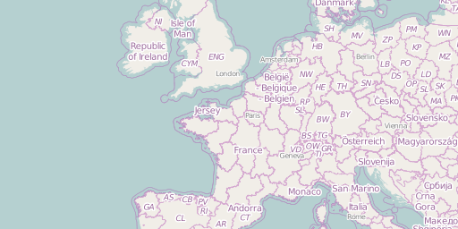

Smopy
=====

Give a box in geographical coordinates (latitude/longitude), Smopy returns an OpenStreetMap tile image at any zoom level!

```python
import smopy
map = smopy.Map((42., -1., 55., 3.), z=4)
map.show_ipython()
```


You can also import the map in matplotlib and convert from geographical coordinates to pixels easily.

```python
x, y = map.to_pixels(48.86151, 2.33474)
ax = map.show_mpl(figsize=(8, 6))
ax.plot(x, y, 'or', ms=10, mew=2);
```


[See the example notebook](http://nbviewer.ipython.org/github/rossant/smopy/blob/master/examples/example1.ipynb)

## Installation

Smopy currently requires:

* PIL or Pillow
* NumPy
* matplotlib
* IPython

To install, `pip install smopy` or git clone and put the folder in your PYTHONPATH.


## Terms of use

This module fetches image maps from [OpenStreetMap](http://www.openstreetmap.org/)'s servers. See the [usage policy](http://wiki.openstreetmap.org/wiki/Tile_usage_policy). In particular, **be careful not to retrieve large maps** as this can overload the servers.


